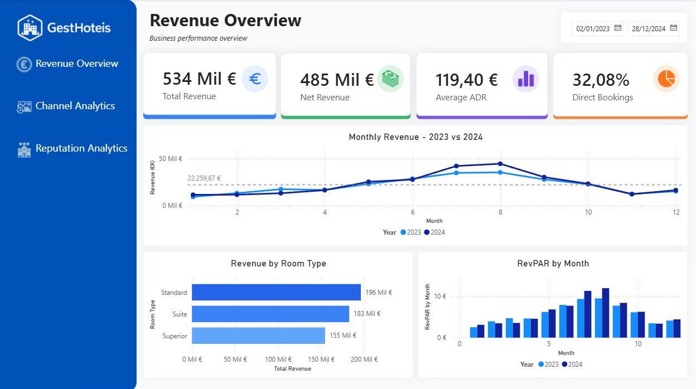
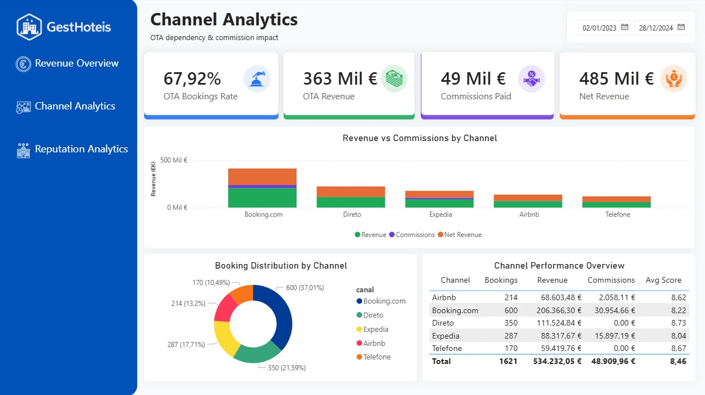
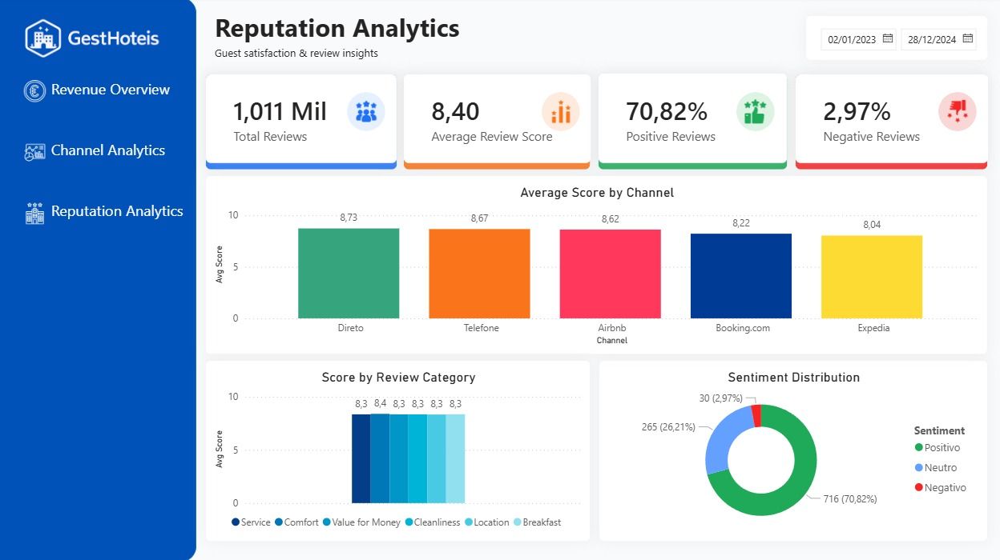

# 🏨 Hotel Operations Analytics Dashboard

A Power BI dashboard analyzing hotel operations, OTA dependency,
and guest satisfaction for a 120-room 4-star hotel in Lisbon, Portugal.

---

## 📸 Dashboard Preview





---

## 📊 About

This project simulates a real-world hospitality analytics scenario
for a 120-room 4-star hotel in Lisbon, Portugal.
Built to answer three core business questions:

- **How dependent are we on OTAs — and what is it costing us?**
- **What do guests say, and how does it impact the business?**
- **Are we making data-driven decisions or relying on gut feeling?**

---

## 🔍 Key Business Insights

### Revenue
- Total revenue of **€534K** across 2023–2024
- RevPAR grew **+20.9% YoY** in July and **+26% in August**
- Standard rooms generate the highest total revenue **(€196K)**
- Clear seasonality: August revenue is **4x higher** than January

### Channel Analytics
- **67.9% of bookings** come through OTA platforms
- Hotel paid **€48,910 in OTA commissions** over 2 years
- Expedia has the **highest commission rate (18%)** and
  the **lowest guest satisfaction score (8.04)**
- Direct bookings have **zero commission cost** and the
  **highest satisfaction score (8.73)**

### Reputation
- Overall average score: **8.40 / 10**
- **70.82% positive** reviews, only **2.97% negative**
- Direct channel guests are the most satisfied **(8.73)**
- Breakfast is the lowest scoring review category

---

## 💡 Strategic Recommendations

1. **Reduce Expedia dependency** — highest cost, lowest satisfaction
2. **Invest in direct booking campaigns** — zero commission,
   best guest experience
3. **Address breakfast quality** — lowest scoring category
   across all channels
4. **Launch low-season promotions** — January RevPAR is 4x
   below August peak

---

## 🛠️ Tech Stack

| Tool | Usage |
|------|-------|
| Python 3.13 | Data generation & ETL pipeline |
| Pandas | Data transformation & analysis |
| Power BI Desktop | Dashboard & visualizations |
| DAX | KPI measures & calculated columns |
| Power Query | Data import & type corrections |

---

## ▶️ How to Run

1. **Clone the repository**:
```git clone https://github.com/luanafernanda/hotel-analytics-dashboard```

2. **Install dependencies:**
```pip install pandas numpy faker openpyxl```

3. **Generate the dataset:**
```python gerar_dados.py```

4. **Run ETL pipeline:** 
``` python analise.py ```

---
## 👤 Author

**Luana Fernanda** — Data Analyst, Lisbon

[LinkedIn](https://linkedin.com/in/luana-fernanda) · [GitHub](https://github.com/luanafernanda)
